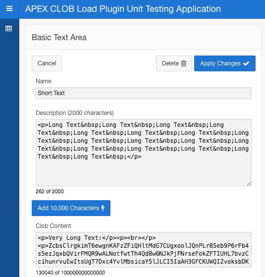

# APEX Plugin CLOB Load
Plugin for displaying and saving CLOB content in a form.

Event based architecture that writes the contents of a CLOB to a collection that can then be used to write to any custom location needed.

This is a modification of the previously released Enkitec CLOB Load Plugin enabled for use with APEX 5.X.X

## Short Description
When using a Text Area or Rich Text Editor, you can save larger amounts of data to a CLOB table column by adding the following events:

- Before Page Submit: Takes the contents of the CLOB and writes it to a collection.  Feature parameters in the plugin make this simple

- Page Process: Moves the content to the edited record

- Page Load Dynamic Action: When viewing a record, pulls the full content of the CLOB from the table and assigns it to a page item

The included application is a working basic example of plugin.

## Content
**apex-plugin-clob-load.sql**
* Plugin Only

**apex-plugin-clob-load-UnitTestApp.sql**
* Basic example of CLOB plugin used in a sample application

# Unit Test Application
This is a basic implementation app that tests the different reagions and features.

# Requirements
APEX 5.0.0 +

# Version Notes
Short description of changes

## 2017.06.21 (being tested)
    New version structure
    Bug fix for Rich Text Area
    Implemented source changes into plugin and app export
    Unit Test App - modified to use collections
## 1.0
    Initial port from original source

# Historical Credits
* Dan McGhan
* Tyson Jouglet
* Enkitec Plugin Repository

